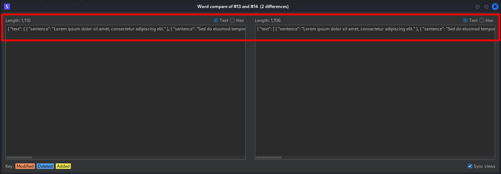
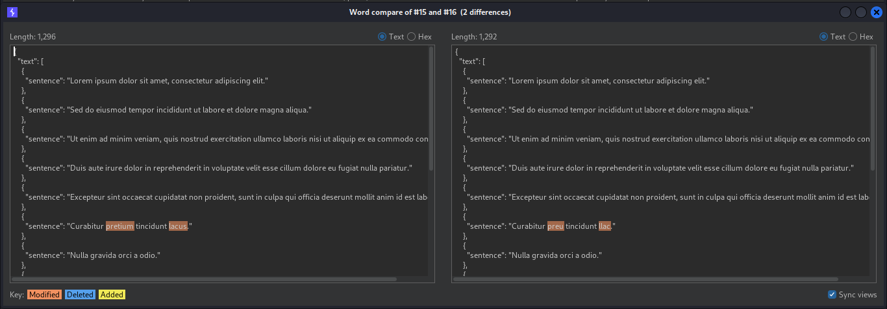
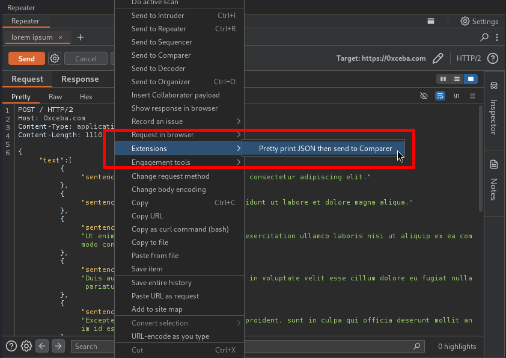

# Burp Pretty Print JSON Then Send to Comparer
### Description
This is a productivity extension for Burp Suite that adds an action to the user's context menu to pretty print format JSON data before sending it to the Comparer tool. This allows the user to format the JSON data in a way that makes it easier to read when doing side-by-side comparisons in Comparer. The extension mostly mimics the behavior of the default "Send to Comparer" action in that it will send the user's selected data to Comparer if there is selected data, or it will send the message body to Comparer if there is no selected data.

Using the default "Send to Comparer" action on JSON data will send the data as a single line, unless the data already includes formatting whitespace characters, as seen below:

Sending pretty print formatted JSON data to Comparer makes the data significantly easier to read, and it minimizes cases where the user has to interact with the data using the dreaded 💀 horizontal scrollbar 💀, as seen below:

### Usage
1. View a request or response message in the message editor (e.g. from within the Proxy or Repeater tools).
2. Open the message's context menu by right-clicking the message or by clicking the "Message actions" hamburger button in the top right of the message editor.
3. Execute the extension by hovering over the "Extensions" menu item -> select "Pretty print then send to Comparer", as seen below:
   