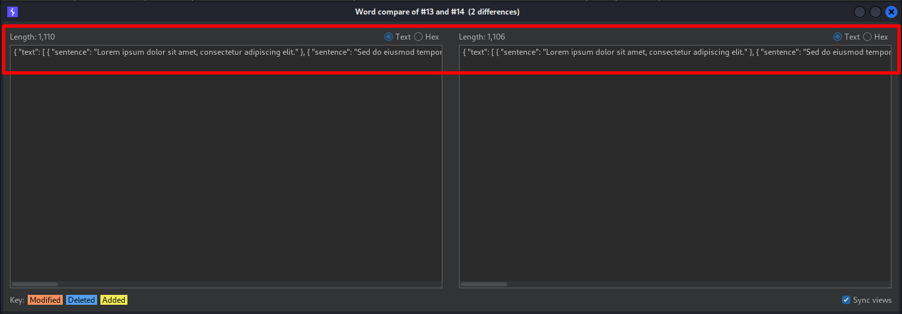
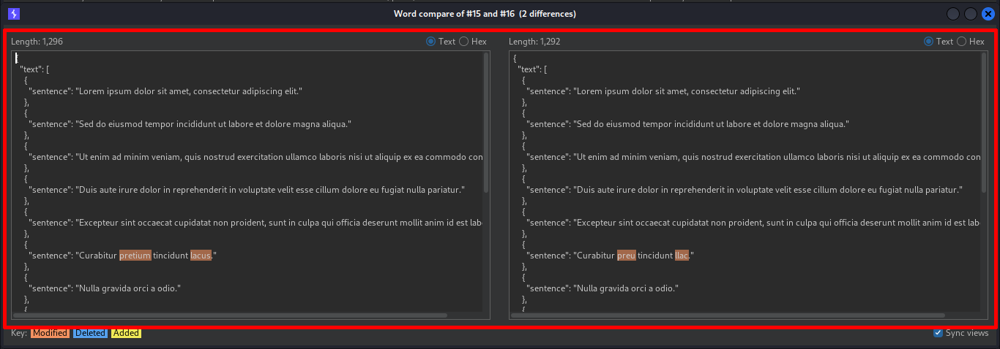
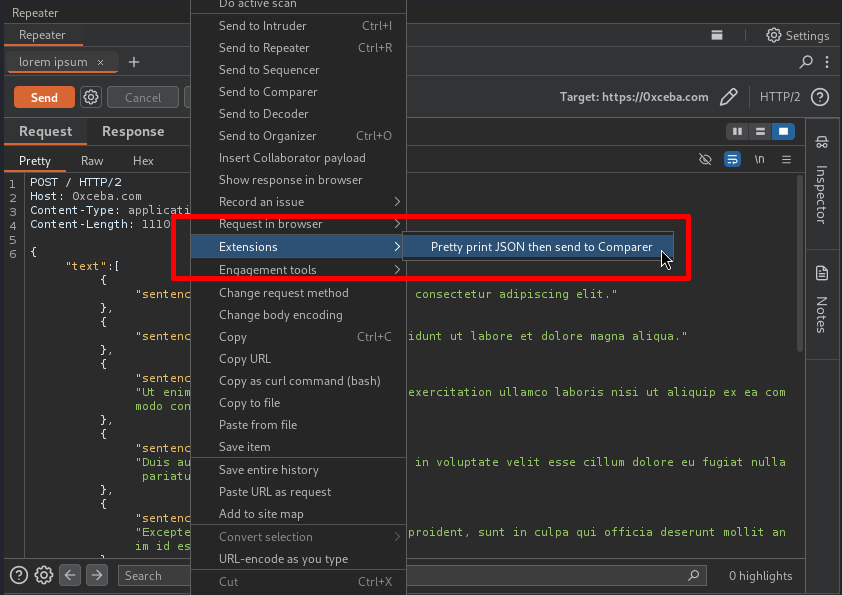

# Burp Prettify JSON Then Send to Comparer
### Description
Prettify JSON Then Send to Comparer is a Burp Suite extension that enhances Burp by adding an action to the user's context menu to pretty-print JSON data before sending it to the Comparer tool. This extension boosts user productivity by allowing users to add standardized indentations and line breaks to JSON data before sending it to Comparer. Interacting with non-pretty-printed JSON data in Comparer is cumbersome because the tool displays the data on a single line so users have to interact with it using the dreaded 💀 horizontal scrollbar 💀.

The benefits of using this extension can be seen in the following screen captures:
* Using Burp's default "Send to Comparer" action to send and interact with JSON data in the Comparer tool:
  

* Using this extension to send and interact with JSON data in the Comparer tool:
  

### Usage
This extension mostly mimics the behavior of the default "Send to Comparer" action in that it will send the user's selected data to the Comparer tool if there is selected data, or it will send the message body to Comparer if there is no selected data. Follow the following steps to use this extension:

1. View a request or response message in the message editor (e.g. from within the Proxy or Repeater tools).
2. Open the message's context menu by right-clicking the message or by clicking the "Message actions" hamburger button in the top right of the message editor.
3. Execute the extension by hovering over the "Extensions" menu item -> select "Prettify then send to Comparer", as seen below:
   
4. Interact with the pretty-printed JSON data in Comparer.